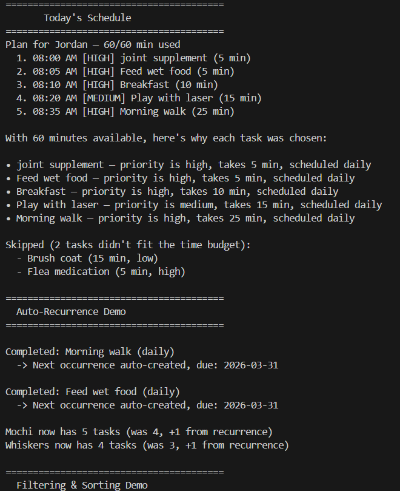

# PawPal+ (Module 2 Project)

You are building **PawPal+**, a Streamlit app that helps a pet owner plan care tasks for their pet.

## Scenario

A busy pet owner needs help staying consistent with pet care. They want an assistant that demo:

- Track pet care tasks (walks, feeding, meds, enrichment, grooming, etc.)
- Consider constraints (time available, priority, owner preferences)
- Produce a daily plan and explain why it chose that plan

Your job is to design the system first (UML), then implement the logic in Python, then connect it to the Streamlit UI.

## What you will build

Your final app should:

- Let a user enter basic owner + pet info
- Let a user add/edit tasks (duration + priority at minimum)
- Generate a daily schedule/plan based on constraints and priorities
- Display the plan clearly (and ideally explain the reasoning)
- Include tests for the most important scheduling behaviors

## Getting started

### Setup

```bash
python -m venv .venv
source .venv/bin/activate  # Windows: .venv\Scripts\activate
pip install -r requirements.txt
```

### Suggested workflow

1. Read the scenario carefully and identify requirements and edge cases.
2. Draft a UML diagram (classes, attributes, methods, relationships).
3. Convert UML into Python class stubs (no logic yet).
4. Implement scheduling logic in small increments.
5. Add tests to verify key behaviors.
6. Connect your logic to the Streamlit UI in `app.py`.
7. Refine UML so it matches what you actually built.


## Features

- **Priority-based scheduling** — Tasks are sorted by priority (high > medium > low), with ties broken by shortest duration first, then packed into the owner's daily time budget using a greedy algorithm.
- **Time-slot assignment** — Each scheduled task receives a start time beginning at 8:00 AM, with tasks placed sequentially so the owner knows exactly when to do what.
- **Conflict detection** — The scheduler checks all task pairs for overlapping time slots and flags any conflicts as warnings.
- **Per-pet fairness (round-robin)** — Tasks are selected in a round-robin across pets so that no single pet's tasks dominate the schedule, even under a tight time budget.
- **Frequency filtering** — Tasks track their `last_completed` date. Weekly and monthly tasks are automatically skipped on days they aren't due, preventing over-scheduling.
- **Daily/weekly recurrence** — When a task is marked complete, a new instance is auto-created with the correct next `due_date` (e.g., tomorrow for daily, +7 days for weekly).
- **Special needs auto-tasks** — Adding a special need to a pet (e.g., "joint supplement") automatically generates a corresponding high-priority meds task if one doesn't already exist.
- **Filtering and sorting** — Tasks can be filtered by completion status and/or pet name, and any task list can be sorted by priority and duration on demand.
- **Plan explanation** — The scheduler explains why each task was included and lists any tasks that were skipped due to the time budget.


## Demo

<a href="demo.png" target="_blank"></a>.

## Testing PawPal+

`python -m pytest`

The test suite (20 tests) covers the following areas:

- **Task basics** — marking tasks complete, adding tasks to pets
- **Budget constraints** — zero available time, tasks exceeding the budget, exact-fit scenarios, all-completed edge case
- **Sorting** — priority tiebreakers fall back to shortest duration, single-task lists
- **Recurring tasks** — daily and weekly recurrence generate correct due dates, unrecognized frequencies produce no recurrence, completing the same task twice chains correctly
- **Fairness** — pets with no tasks don't crash the round-robin, three-pet plans include every pet
- **Special needs** — no duplicate needs, auto-generated tasks don't duplicate existing ones
- **Chronological ordering** — plan tasks have ascending start times beginning at 8:00 AM
- **Conflict detection** — generated plans have zero overlaps, manually overlapping tasks are flagged

**Confidence Level: 4/5 stars** — The core scheduling, sorting, recurrence, and conflict logic are well covered. The missing star is for untested areas like very large task counts, boundary times near midnight, and the Streamlit UI integration which is only testable manually.
