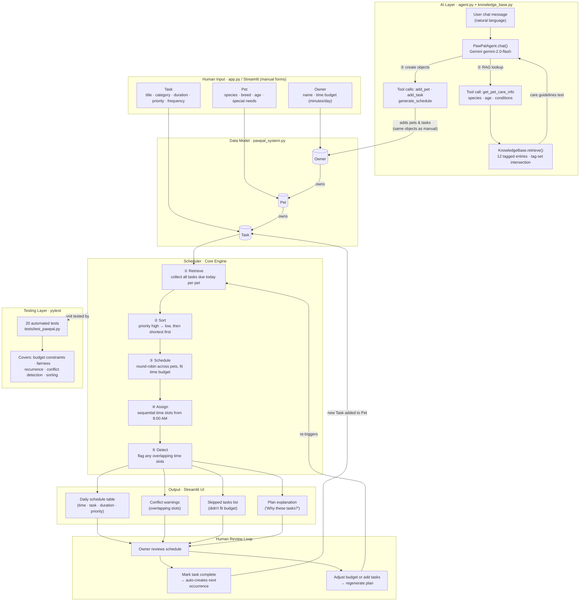

# PawPal+ System Diagram



## Component Summary

| Component | Role | Type |
|---|---|---|
| **Streamlit UI** (`app.py`) | Collects human input and chat messages, renders output | Human interface |
| **Owner / Pet / Task** (`pawpal_system.py`) | Holds all state — time budget, pet profiles, task list | Data model |
| **Scheduler** (`pawpal_system.py`) | Retrieves, sorts, schedules, assigns times, detects conflicts | Processing engine |
| **PawPalAgent** (`agent.py`) | Gemini-powered agent; orchestrates RAG retrieval and data model tool calls | AI layer |
| **KnowledgeBase** (`knowledge_base.py`) | 12 tagged pet care entries; `retrieve()` matches species, age group, and condition tags | RAG retrieval |
| **Human Review Loop** | Owner reads the plan, marks tasks done, tweaks inputs, reruns | Human-in-the-loop |
| **pytest suite** (`tests/test_pawpal.py`) | Verifies scheduler logic across 20 edge cases | Automated testing |

## Data Flow

```
Manual input
    └─▶ Owner / Pet / Task objects
            └─▶ Scheduler.generate_plan()
                    ├─▶ filter due tasks per pet
                    ├─▶ sort by priority + duration
                    ├─▶ round-robin pack into time budget
                    ├─▶ assign 8 AM time slots
                    └─▶ detect conflicts
                            └─▶ Schedule table + warnings + explanation
                                    └─▶ Human reviews
                                            ├─▶ mark complete → new Task → back to Scheduler
                                            └─▶ adjust inputs → regenerate plan

Natural language input (AI chat)
    └─▶ PawPalAgent (Gemini function-calling loop)
            ├─▶ get_pet_care_info → KnowledgeBase.retrieve(species, age, conditions)
            │       └─▶ returns evidence-based guidelines (e.g. shorter walks for senior arthritic dog)
            ├─▶ add_pet  → same Owner/Pet objects as manual path
            ├─▶ add_task → Task parameters informed by retrieved guidelines
            └─▶ generate_schedule → same Scheduler engine as manual path
```
