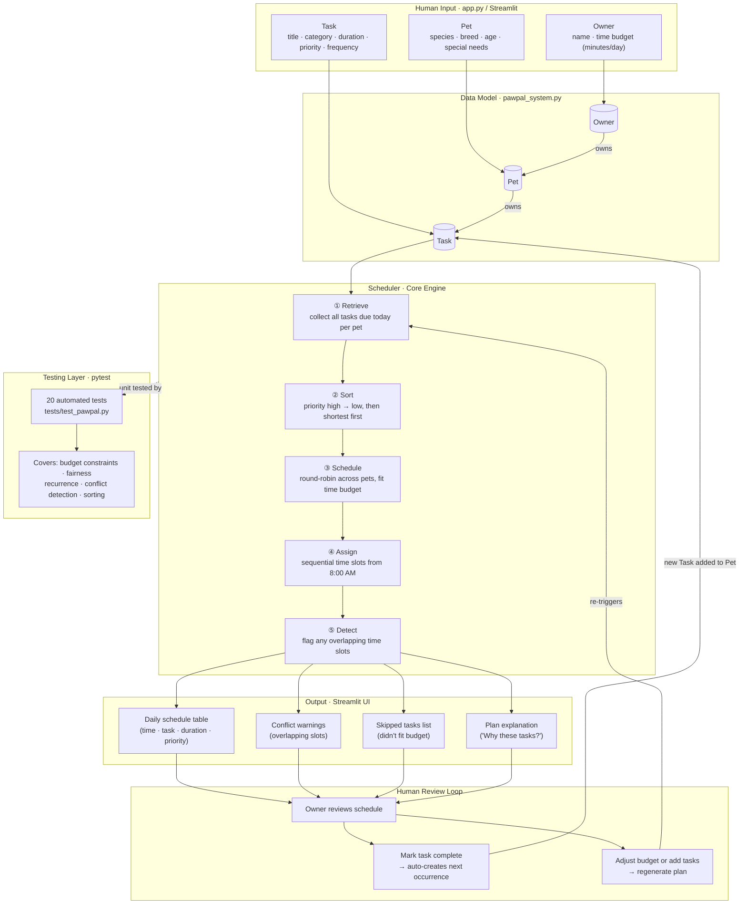

# PawPal+ System Diagram



## Component Summary

| Component | Role | Type |
|---|---|---|
| **Streamlit UI** (`app.py`) | Collects human input, renders output | Human interface |
| **Owner / Pet / Task** (`pawpal_system.py`) | Holds all state — time budget, pet profiles, task list | Data model |
| **Scheduler** (`pawpal_system.py`) | Retrieves, sorts, schedules, assigns times, detects conflicts | Processing engine |
| **Human Review Loop** | Owner reads the plan, marks tasks done, tweaks inputs, reruns | Human-in-the-loop |
| **pytest suite** (`tests/test_pawpal.py`) | Verifies scheduler logic across 20 edge cases | Automated testing |

## Data Flow

```
Human input
    └─▶ Owner / Pet / Task objects
            └─▶ Scheduler.generate_plan()
                    ├─▶ filter due tasks per pet
                    ├─▶ sort by priority + duration
                    ├─▶ round-robin pack into time budget
                    ├─▶ assign 8 AM time slots
                    └─▶ detect conflicts
                            └─▶ Schedule table + warnings + explanation
                                    └─▶ Human reviews
                                            ├─▶ mark complete → new Task → back to Scheduler
                                            └─▶ adjust inputs → regenerate plan
```
