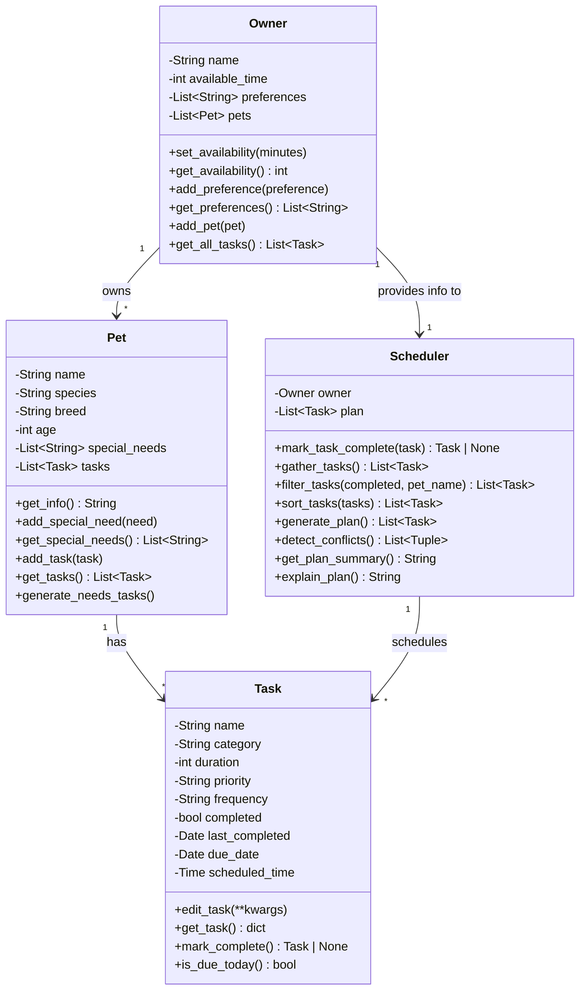

```mermaid
classDiagram
    class Task {
        -String name
        -String category
        -int duration
        -String priority
        -String frequency
        -bool completed
        -Date last_completed
        -Date due_date
        -Time scheduled_time
        +edit_task(**kwargs)
        +get_task() dict
        +mark_complete() Task | None
        +is_due_today() bool
    }

    class Pet {
        -String name
        -String species
        -String breed
        -int age
        -List~String~ special_needs
        -List~Task~ tasks
        +get_info() String
        +add_special_need(need)
        +get_special_needs() List~String~
        +add_task(task)
        +get_tasks() List~Task~
        +generate_needs_tasks()
    }

    class Owner {
        -String name
        -int available_time
        -List~String~ preferences
        -List~Pet~ pets
        +set_availability(minutes)
        +get_availability() int
        +add_preference(preference)
        +get_preferences() List~String~
        +add_pet(pet)
        +get_all_tasks() List~Task~
    }

    class Scheduler {
        -Owner owner
        -List~Task~ plan
        +mark_task_complete(task) Task | None
        +gather_tasks() List~Task~
        +filter_tasks(completed, pet_name) List~Task~
        +sort_tasks(tasks) List~Task~
        +generate_plan() List~Task~
        +detect_conflicts() List~Tuple~
        +get_plan_summary() String
        +explain_plan() String
    }

    Owner "1" --> "*" Pet : owns
    Owner "1" --> "1" Scheduler : provides info to
    Pet "1" --> "*" Task : has
    Scheduler "1" --> "*" Task : schedules
```
